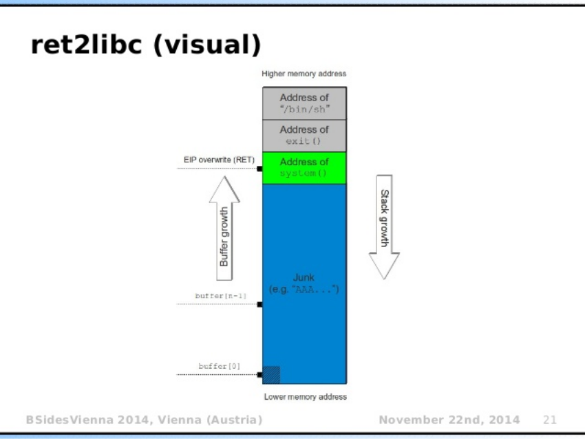

Pattern:
'AAA%AAsAABAA$AAnAACAA-AA(AADAA;AA)AAEAAaAA0AAFAAbAA1AAGAAcAA2AAHAAdAA3AAIAAeAA4AAJAAfAA5AAKAAgAA6AALAAhAA7AAMAAiAA8AANAAjAA9AAOAAkAAPAAlAAQAAmAARAAoAASAApAATAAqAAUAArAAVAAtAAWAAuAAXAAvAAYAAwAAZAAxAAyA'

system : 0x7ffff7c50d60
exit: 0x7ffff7c455f0 
shell: 0x7ffff7dd8698 OU 0x68732f6e69622f

We can find the offset of a symbol by using both of the following methods (example with `system` method). First, with readelf
```
readelf -s glibc/libc.so.6| grep system
```
and read the second field.
Second with Radare2,
```
[0x00029f50]> fs symbols
[0x00029f50]> f | grep system
0x00050d60 45 sym.__libc_system
0x00050d60 45 sym.system
0x00169140 103 sym.svcerr_systemerr
```
It's that easy because ASLR is not activated. Radare2 can be used the same way to get the '/bin/sh' offset:
```
[0x00029f50]> f  | grep sh
0x001d52c5 19 str.Trailing_backslash
0x001d6220 14 str.short_opt_col
0x001d6a18 8 str.gshadow
0x001d6ab2 7 str.shadow
0x001d6ac0 14 str.shadow_compat
0x001d8561 27 str._usr_share_locale_langpack
0x001d8698 8 str._bin_sh    <------------------- The /bin/sh
0x001da062 10 str._dev_shm_
0x001da13c 9 str._bin_csh
0x001da145 12 str._etc_shells
...
``` 

The vulnerability in this program occurs in spell_upload. For an unknown reason, 600 characters of the file are copied to a buffer that is limited to 32 bytes. This paves the way for a buffer overflow. We can therefore place whatever address we want on the stack as long as the content starts with the signature of the boy who lived and buffer totaling 40 characters (including the signature).

The problem with this binary is that ASLR is actually activated. We find this information by running the program through gdb multiple times and running `info proc mappings` each time. We can see that the addresses to libc6 is never the same, which means that ASLR is activated. 
Therefore, we need to find the base address of libc6 dynamically and use this information to calculate the actual address of the `system` and `exit` symbols and `/bin/sh` string. Since their offset will stay the same inside libc6, we can find this informations using radare2 with the library that was given to us. To find the base address of libc6, we can use the following technique. First, put of a `pop rdi` gadget on the stack and then the address of puts according to the GOT. This will place the address of puts in the `rdi` register. Then, place puts' PLT address on the stack. This will have the effect of displaying the address of puts. You can then use pwntools to grab this information and calcule the base address of libc6 by substracting the offset of puts to the newly uncovered information.

The final payload is set by placing the address of `/bin/sh` in `rdi` register, followed by the `system` function address and, finally, `exit` address.
